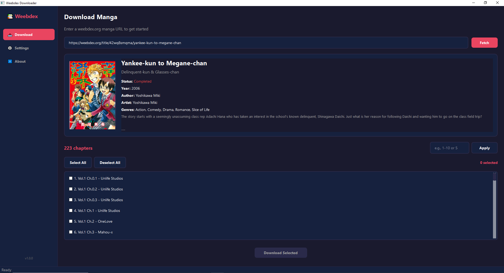

# 📚 Weebdex Downloader

<div align="center">


**A modern manga downloader for [weebdex.org](https://weebdex.org) with both CLI and GUI interfaces.**

[Features](#-features) • [Installation](#-installation) • [Usage](#-usage) • [Screenshots](#-screenshots) • [Configuration](#-configuration)

</div>

---

## ✨ Features

| Feature | Description |
|---------|-------------|
| 🚀 **Concurrent Downloads** | Download multiple chapters and images simultaneously |
| 📁 **Multiple Formats** | Save as Images, PDF, or CBZ (with ComicInfo.xml) |
| 🔄 **Auto Retry** | 3 retry attempts with exponential backoff |
| 🎨 **Modern GUI** | Beautiful dark-themed PyQt6 interface |
| ⌨️ **Rich CLI** | Interactive terminal with Typer + Rich |
| 📋 **Flexible Selection** | Single, range, or all chapter selection |
| 💾 **Persistent Settings** | Configuration saved to JSON |
| 📝 **Metadata Support** | ComicInfo.xml for comic readers |

---

## 📦 Installation

### Prerequisites
- Python 3.8 or higher

### Steps

```bash
# Clone the repository
git clone https://github.com/Yui007/weebdex-downloader.git
cd weebdex-downloader

# Install dependencies
pip install -r requirements.txt
```

---

## 🚀 Usage

### GUI (Recommended)

```bash
python run_gui.py
```

### CLI

```bash
python main.py
```

---

## 📸 Screenshots

### GUI Interface



---

## ⚙️ Configuration

Settings are saved in `config.json` and can be modified via the GUI or CLI:

| Setting | Default | Description |
|---------|---------|-------------|
| `download_format` | `images` | Output format: `images`, `pdf`, `cbz` |
| `keep_images` | `true` | Keep images after PDF/CBZ conversion |
| `concurrent_chapters` | `3` | Parallel chapter downloads |
| `concurrent_images` | `5` | Parallel image downloads per chapter |
| `download_path` | `./downloads` | Output directory |
| `enable_logs` | `false` | Enable detailed logging |

---

## 📁 Project Structure

```
weebdex-downloader/
├── main.py              # CLI entry point
├── run_gui.py           # GUI entry point
├── requirements.txt     # Dependencies
├── src/                 # Backend modules
│   ├── config.py        # Configuration management
│   ├── models.py        # Data models
│   ├── api/             # API client
│   ├── scraper/         # URL parsing & scraping
│   ├── downloader/      # Download & conversion
│   ├── cli/             # CLI interface
│   └── utils/           # Utilities
└── gui/                 # PyQt6 GUI
    ├── main_window.py   # Main window
    ├── screens/         # UI screens
    ├── workers/         # Background threads
    ├── components/      # Reusable widgets
    └── styles/          # Theme styling
```

---

## 📋 Requirements

```
typer[all]
rich
httpx
Pillow
pydantic
PyQt6
```

---

## 📄 License

This project is for educational purposes only. Please support the original creators by reading manga on official platforms.

---

<div align="center">

Made with ❤️ for manga enthusiasts

</div>
